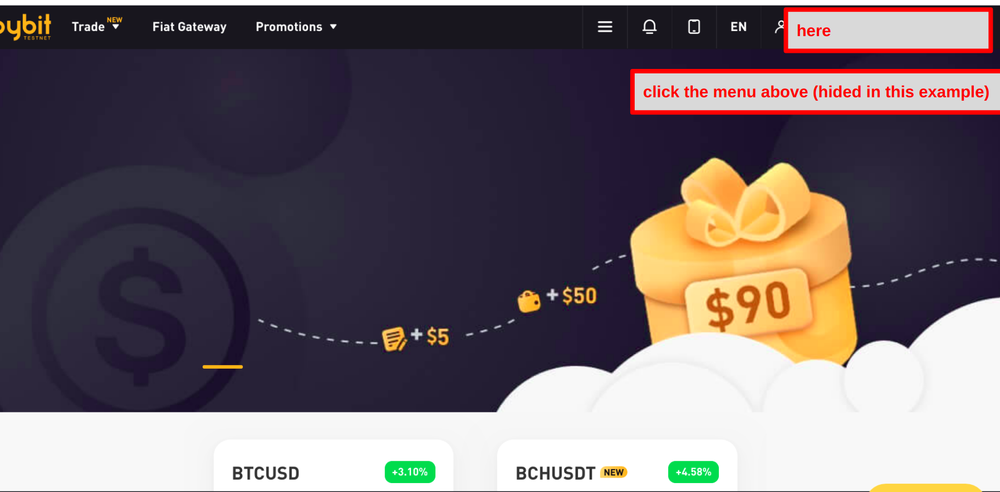
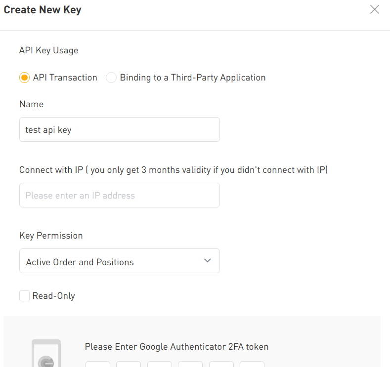

# Cryptocurrency-algorithm-trading-tutorial.-Trade-automatically-using-Python-codes.

In this repository, I show you how to start algorithm trade for beginners and sample trading strategies using golden cross signal.  
**Following steps below, anyone can run code of algorithm trading in 2 hours.**

## What you need to trade cryptos with program.

You need 3 things to start algorithm trading of cryptos.

1. Account of crypt exchange.
2. API keys.
3. Program code.

In the following part, I explain from 1 to 3.

### Create your crypto exchange account.

In this project, we use bybit.  
Bybit is one of the most major crypto exchanges in the world.  
We can trade derivatives related to cryptos including BTC, ETH, USDT and so on.

#### Advantages in using Bybit.

1. Very easy to register.
2. **Very easy to use its API by Python code.**
3. You can get bonus by simply depositing BTC into account.

You only have to prepare e-mail address and password to create an account of Bybit.  
So, you can run the trading code in 2 hours from now.    

Register from the link below.  

[>> Create account of Bybit for free](https://www.bybit.com/en-US?affiliate_id=16528&group_id=0&group_type=1&language=en-US)  

(Now anyone who register from this link and deposit BTC can get bonus(2021/3).  
Enjoy this campaign. )

Also, Bybit provide us with official Python library to use their API.  
It is very useful and [the document of it](https://bybit-exchange.github.io/docs/inverse/#t-introduction) has a lot of information.

#### Disadvantages in using Bybit.

There are a few disadvantages in bybit.

1. **CANT deposit USD.**
2. DIFFICULT to use from ccxt for beginners.

We can deposit into Bybit account cryptos only.  
So, you should send crypts from other exchanges or your wallet.  
The other way is to buy BTC in bybit with credit card etc.  
Anyway, we CANT deposit real money.  
This is an disadvantage.    

Also, famous Python library for crypto botters "ccxt" is not helpful in the case of bybit.  
To me, the setting of args "amount" or "qty" is ambiguous.  
So, in this project, we use official library "bybit".    


[>> Create account of Bybit for free](https://www.bybit.com/en-US?affiliate_id=16528&group_id=0&group_type=1&language=en-US)


### Generate API keys.

**Next, generate your API keys.**  
By inputting API keys into bybit library class as args, your code connects your bybit account.    

2 API keys below are generated at the same time by the following steps.    

**api_key** : public key, which you can open to others if necessary.  
**api_secret_key** : private key you MUST NOT share with others.    

First, login to bybit and select "Authentication" from header menu(indicated the image below).



In authentication menu please make google authentication enabled.  
The menu is in "Two-Factor Authentication" section of the page.  
(The ones who don't have google auth app yet have to install it at this step.)  

Next, go to the page of API key management.  

(header menu(the place your email displayed) => Account & Security => API management)    

And click **"Create New Key"** button.  
You can manage API setting as your preference.  

To run the code of this repository, the setting in this image is just fine.  



(To use particular API key over 3 month, you have to add your IP address into white list.  
  You can find your IP by access to [this page](https://whatismyipaddress.com/).)

When you have done this step the api keys will be shown, so take a note of it.  
Secret key is only shown only at once.  
If you forget it, you have to generate it again.  

### Install libraries needed.

**Install library to control bybit API.**  
Official one is easy to use.  
(ccxt is not easy for me to use in the case of bybit.)  

```
pip3 install bybit
```  

:Other libraries  

```
pip3 install pandas
```  

etc.
### Create your code.

Finally create your own code and run in terminal.  
In this time, we use sample code in this repository.  
Please see **"goldencross.py"**.  

This code is designed to take long position when 2 SMA(simple moving average)s of BTCUSD shows golden cross.  
It also take short position when death cross appears.  

**Golden cross** is a technical chart pattern meaning short term SMA crosses above a long term SMA.  
It is often said signal to buy.  
**Death cross** is the contrary of golden cross and said signal to sell.    

goldencross.py orders forever to take each position following these 2 chart pattern.  


## Bybit API usage samples

In this section, I present some example codes which would be used frequently to create cryptos trading bot.  

```python
# create API instance
api_key=input("Please input your api key of bybit.")
api_secret=input("Please input your api secret key of bybit.")
client = bybit.bybit(test=True, api_key=api_key, api_secret=api_secret)


# Limit order to take long position.
# qty means dollar amount (not bitcoin).
# So,in the example below, you take long position for 98 dollars when BTCUSD touches 41220.
print(client.Order.Order_new(side="Buy",symbol="BTCUSD",order_type="Limit",qty=98,price=41220,time_in_force="GoodTillCancel").result())


# Market order
# You don't have to set arg "price". Program ignores this arg.
# The both below are same.
print(client.Order.Order_new(side="Buy",symbol="BTCUSD",order_type="Market",qty=112,price=41000,time_in_force="GoodTillCancel").result())
print(client.Order.Order_new(side="Buy",symbol="BTCUSD",order_type="Market",qty=112,time_in_force="GoodTillCancel").result())

# If you send sell order when you already have long position your amount of long position decrease.
# You can't have both sides of position same time.


# Info of position you have now.
print(client.Positions.Positions_myPosition(symbol="BTCUSD").result())

# "Buy" or "Sell"
print(client.Positions.Positions_myPosition(symbol="BTCUSD").result()[0]["result"]["side"])

# size of your position（qty）
print(client.Positions.Positions_myPosition(symbol="BTCUSD").result()[0]["result"]["size"])

# leverage size
print(client.Positions.Positions_myPosition(symbol="BTCUSD").result()[0]["result"]["leverage"])

# Change leverage to 15x.
# You can change it using GUI
client.Positions.Positions_saveLeverage(symbol="BTCUSD", leverage="15").result()

# History of your trade
# The first trade #0
print(client.Execution.Execution_getTrades(symbol="BTCUSD").result()[0]["result"]["trade_list"][0])

# The last price of your trade.
print(client.Execution.Execution_getTrades(symbol="BTCUSD").result()[0]["result"]["trade_list"][-1]["exec_price"])


# Your total assets（BTC）.
print(client.Positions.Positions_myPosition(symbol="BTCUSD").result()[0]["result"]["wallet_balance"])

# Your profit or loss (not realized)
print(client.Positions.Positions_myPosition(symbol="BTCUSD").result()[0]["result"]["unrealised_pnl"])

# Cancel all your active order
client.Order.Order_cancelAll(symbol="BTCUSD").result()
```

For more information, see my blog post (written in Japanese).  
[https://in-base.com/crypt-auto-trading-bybit](https://in-base.com/crypt-auto-trading-bybit)

[Bybit official site](https://www.bybit.com/en-US?affiliate_id=16528&group_id=0&group_type=1&language=en-US)
